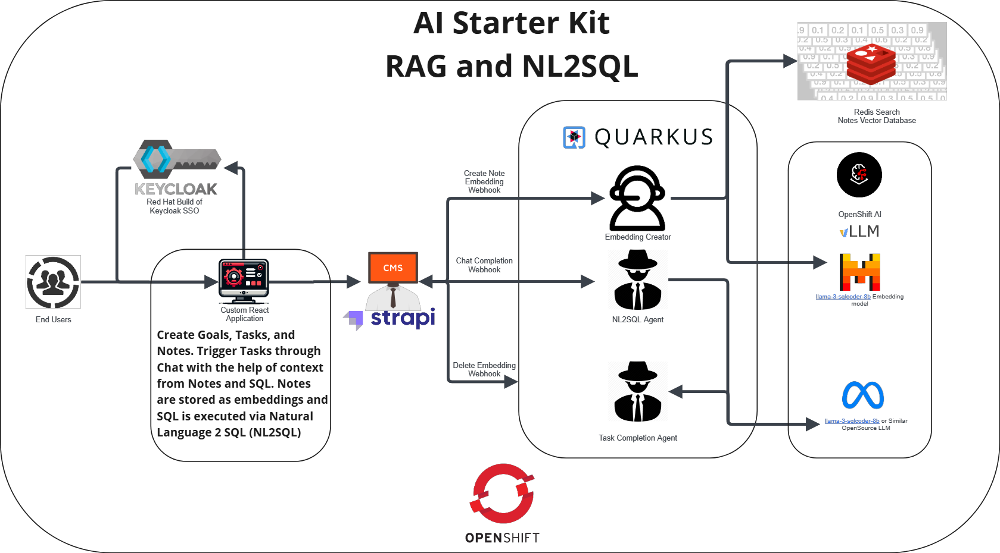

1. First create a namespace in OpenShift. You can call it whatever you want. Everything will go in this namespace.
2. Run **oc project namespace** (replace namespace with your namespace to make sure you're running everything in the right project/namespace)
3. **Clone [repo](https://github.com/purefield-demo-team/ai-hackathon-starter.git)**
4. [Install Red Hat Build of Keycloak](install-keycloak-readme)
5. [Install Strapi Headless CMS](install-strapi-readme)
6. [Install the Redis Search Vector Database](install-redis-search-readme)
7. [Deploy the React-Frontend application](install-react-frontend)
8. [Trying Things Out](testing-the-application)
