**Installing the vector-ask Quarkus back end application components involves 3 parts, each with their own Helm chart:**
1. The Quarkus back end code itself
2. A sample "NL2SQL" database to showcase the assistant that can generate SQL
3. A vLLM model to run locally for inference to generate SQL and answer questions from Tasks
The primary job of the Quarkus application is to fetch notes created by the user through the React front end application (we will deploy that shortly) and to send those notes as context to a local model for generating helpful insights.
1. First, clone the [defog/llama-3-sqlcoder-8b](https://www.google.com/url?q=https://huggingface.co/defog/llama-3-sqlcoder-8b&sa=D&source=editors&ust=1733296429046992&usg=AOvVaw1F_dTGkmCajgCjYyTE5VI4) repository then upload it to an AWS S3 bucket under the path models/llama-3-sqlcoder-8b
2. 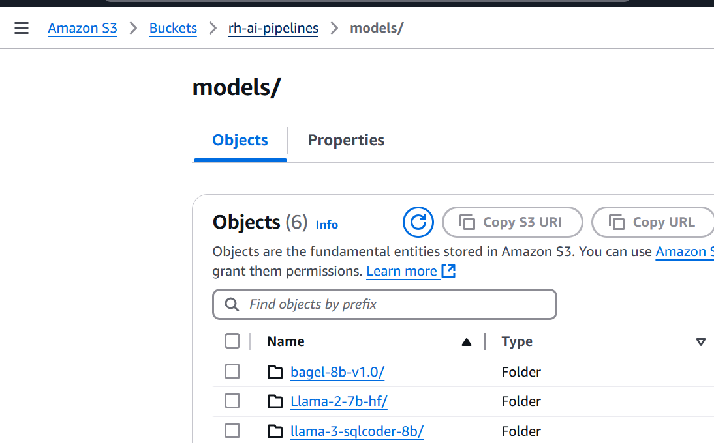
3. Create a DataConnection in OpenShift AI under the DataScience project with the same name as your namespace. This DataConnection is what your llm model inference engine can use to pull the model from the S3 bucket
4. 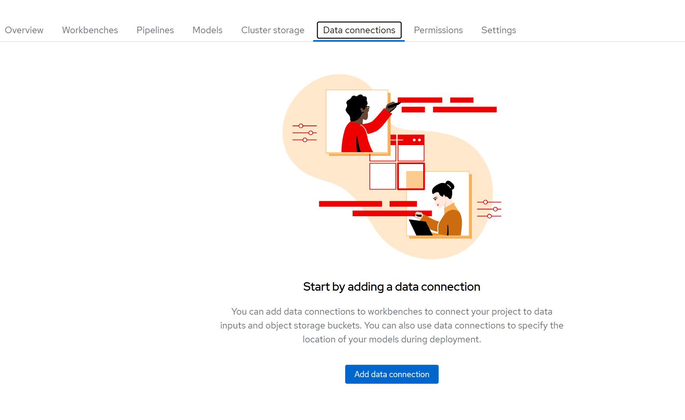
5. 
6. You will need a cluster with 48gb of vram on one node for the next step to be successful
7. Run **helm install vector-ask-model .**
8. 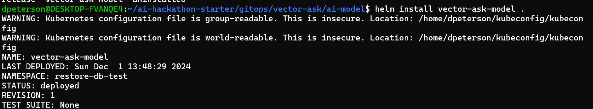
9. Once the model is deployed see the model has endpoints listed from the OpenShift AI console
10. 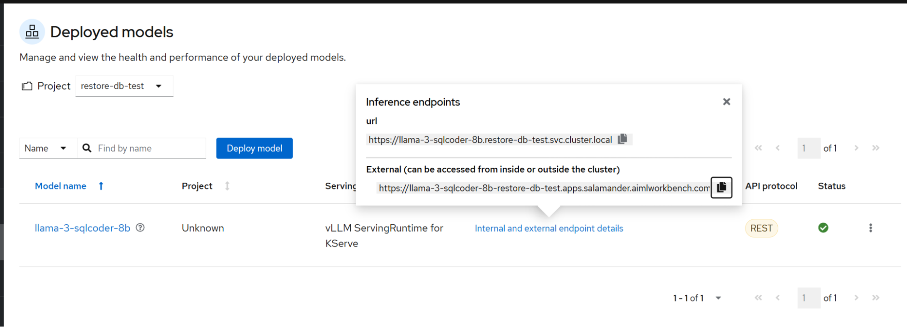
11. Second, deploy the nl2sql-sample-db
12. cd gitops/vector-ask/nl2sql-sample-db
13. Run **helm install nl2sql-sample-postgresql .**
14. **oc port-forward svc/n2sql-sample-postgresql-postgresql 5432**
15. Like when we connected pgAdmin to postgreql databases in previous steps add the connection to the database. Use the postgres admin user
16. 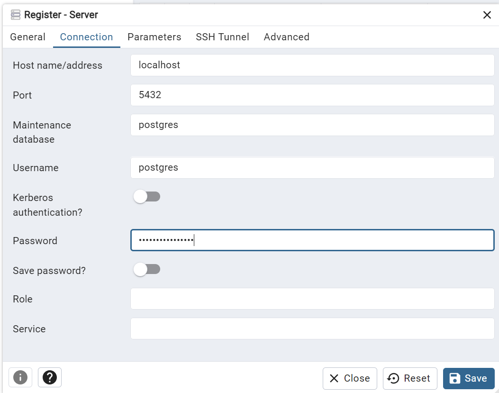
17. Restore gitops/vector-ask/dvdrental.tar
18. 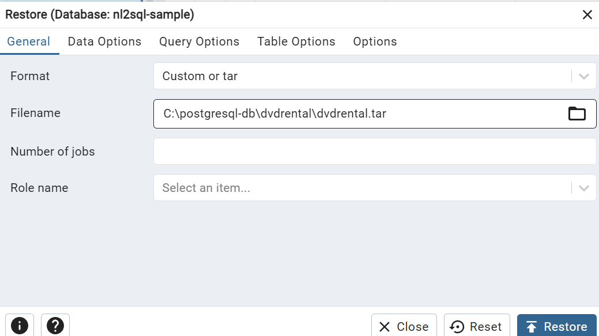
19. **Important!!** Update the userM0I user to be a super user
20. 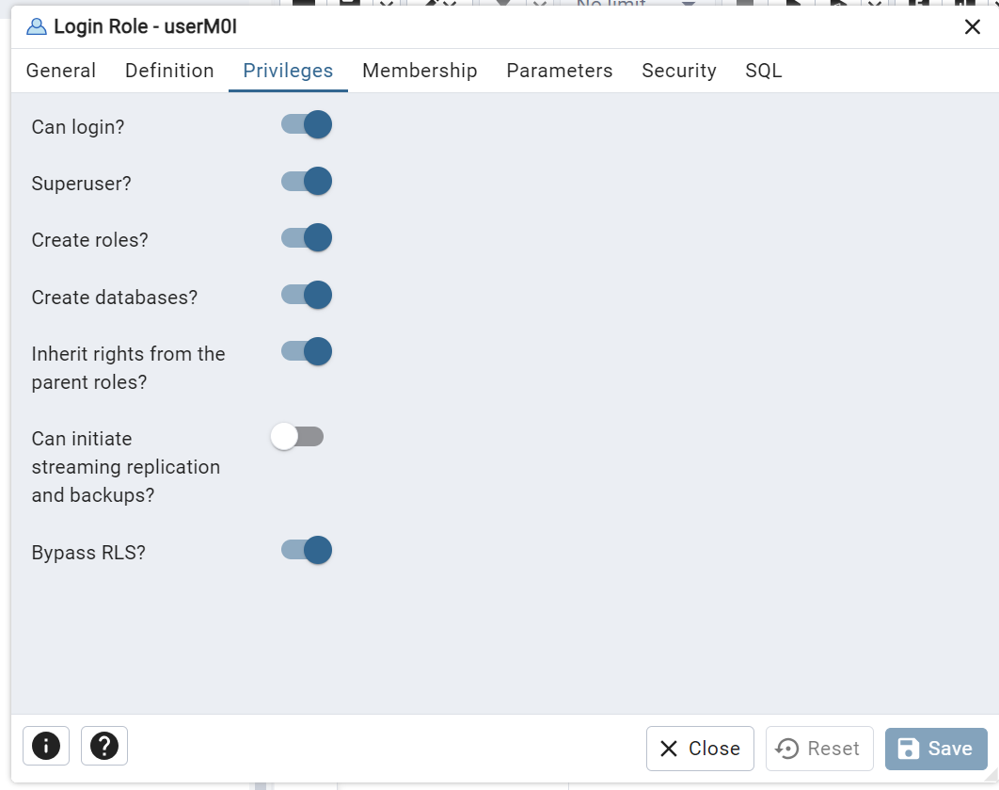
21. cd gitops/vector-ask/quarkus
22. Before running the helm install command, there are a number of values that need to be updated in the values.yaml file
	1. Replace the strapi → host with the route to your strapi instance (keep the :1337 port at the end)
	2. You will also need to create a new strapi api token and add that in place of the xxxxxx for the strapi → token value
	3. 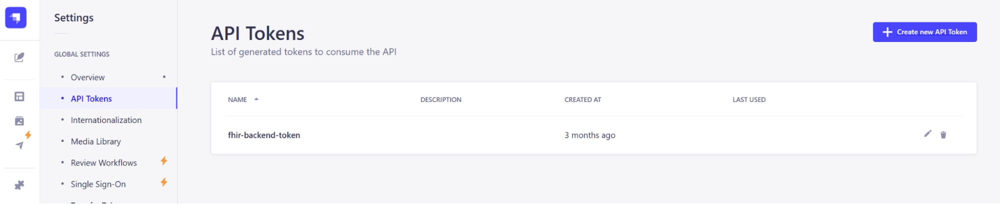
	4. 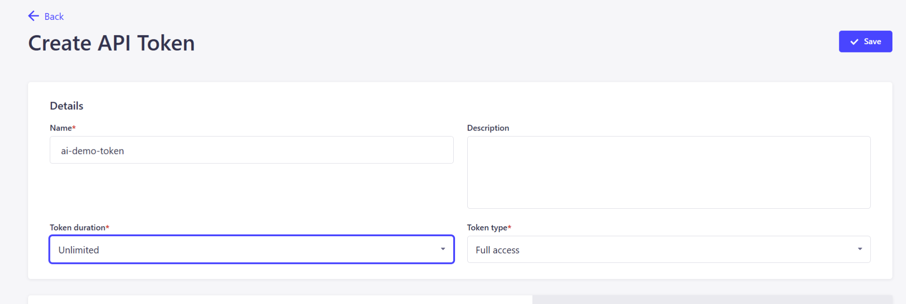
	5. If you have an openai api key, you can place that in the value for openai → key (this is optional. You have the ability to switch between local and openai models)
	6. For redis → host in values.yaml enter the redis-stack route url
	7. For the vllmApiUrl in values.yaml use the endpoint we saw earlier in OpenShift AI:
	8. 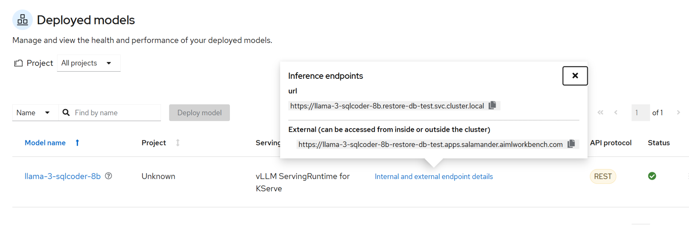
	9. Replace the nl2sqldb → host value in values.yaml with the nl2sql-sample database you just deployed. You will use the service uri, not a route and just replace the <service-hostname> part. Leave the rest of the nl2sqldb → host value the same **ex: jdbc:postgresql://<service-hostname>:5432/nl2sql-sample**
	10. 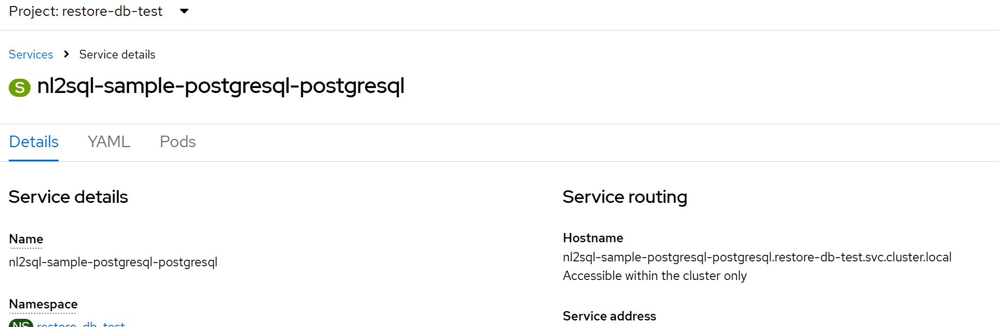
23. Run **helm install vector-ask .**
24. Build vector-ask
25. 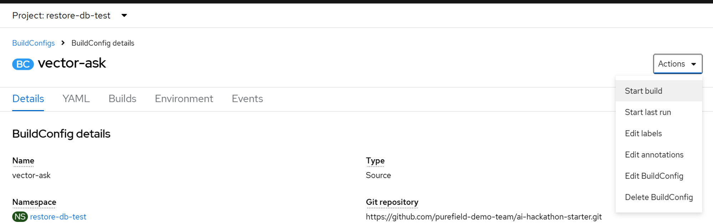