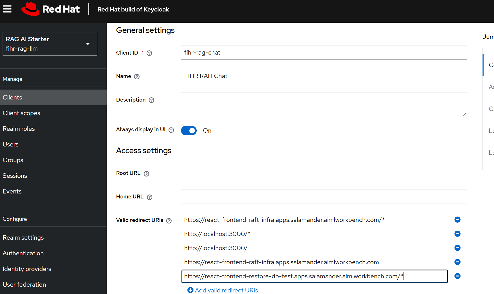
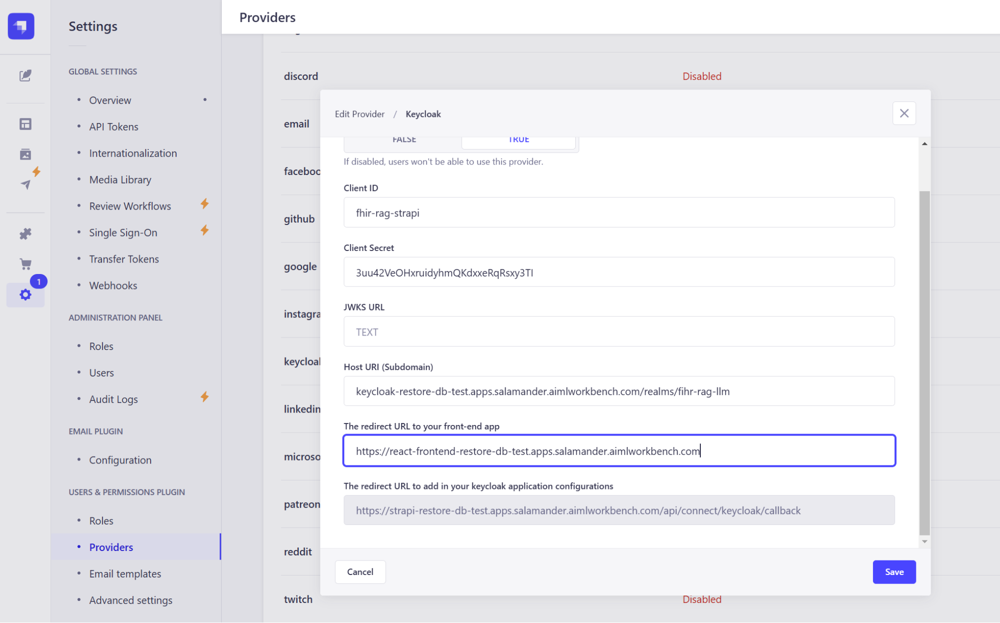
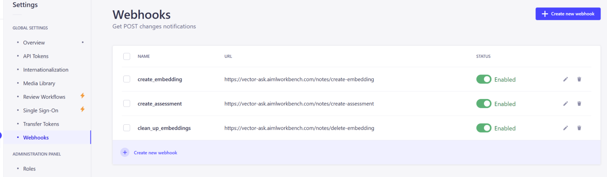

1. cd gitops/react-frontend
2. Similar to the vector-ask quarkus application, we have to update a few values in the values.yaml before running the helm install command
3. Update the strapi, keycloak, and optional openai key values
4. Run **helm install react-frontend .**
5. Run a build from the react-frontend buildconfig
6. We will need to add some valid redirect URIs
7. Login to the keycloak admin console with username:admin password: 5cedc6c2e7474ea8b87b4cf0bcdd7812
8. Under the RAG AI Starter Realm → clients → fihr-rag-chat, Add a Valid Redirect URI for the react-frontend app’s route url with a /* at the end
9. 
10. Back in strapi update the keycloak provider’s “The Redirect URL to your front-end app” field with the url to your react-frontend app
11. 
12. Update the webhook endpoints with your vector-ask quarkus route
13. 
14. Keep the /notes/create-embedding, /notes/create-assessment, /notes/delete-embedding on each of the three webhook urls. Just replace the base url ex. [https://vector-ask.aimlworkbench.com](https://www.google.com/url?q=https://vector-ask.aimlworkbench.com&sa=D&source=editors&ust=1733296429050745&usg=AOvVaw1ii7dXj9-qTAgrem86707D) part