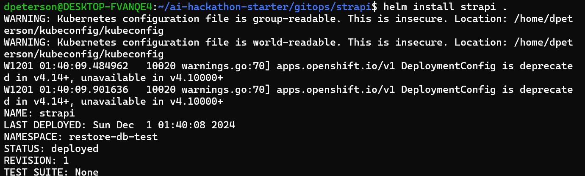
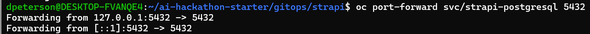
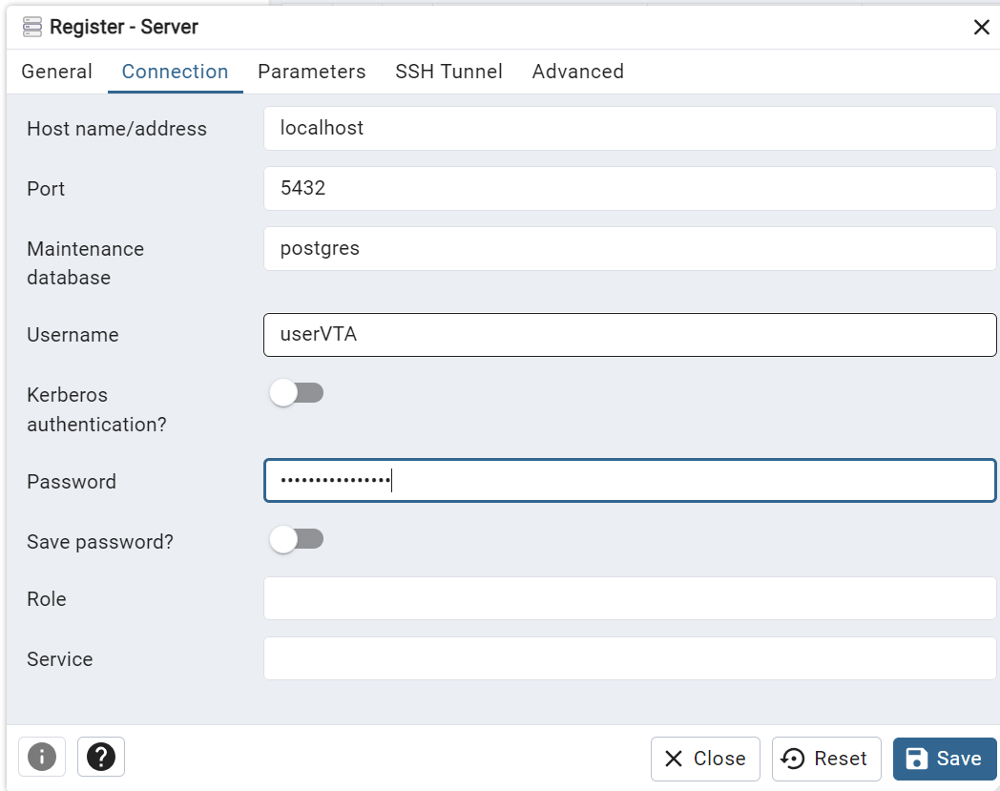
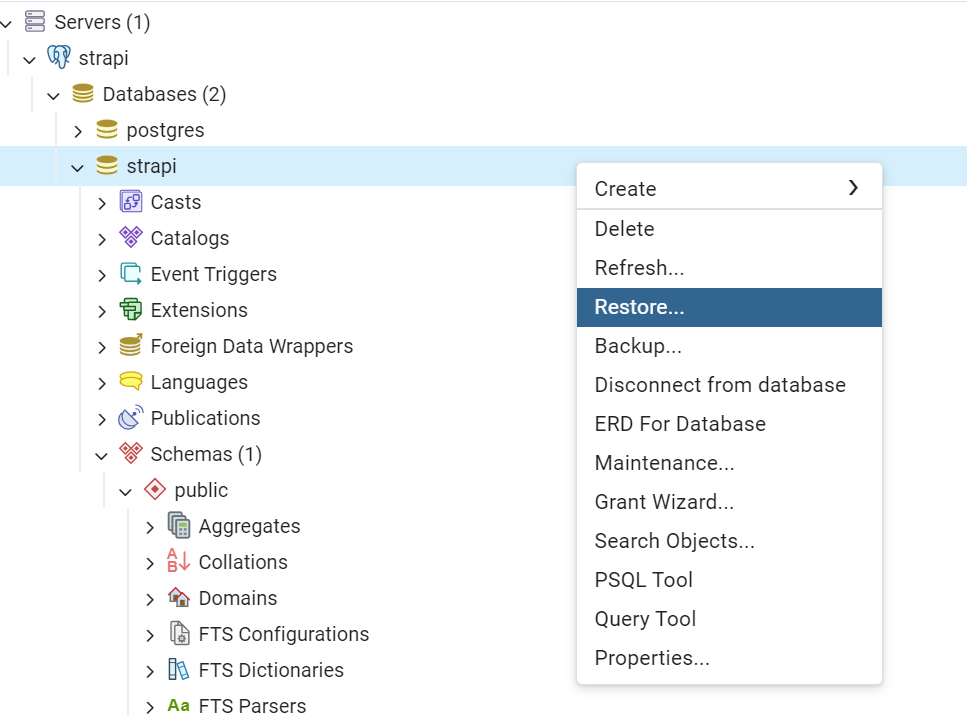
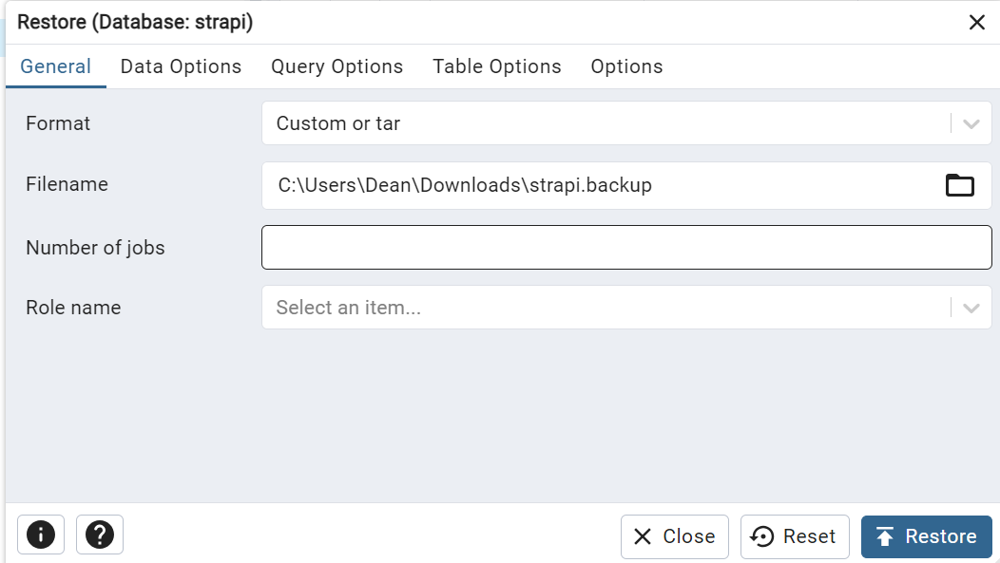
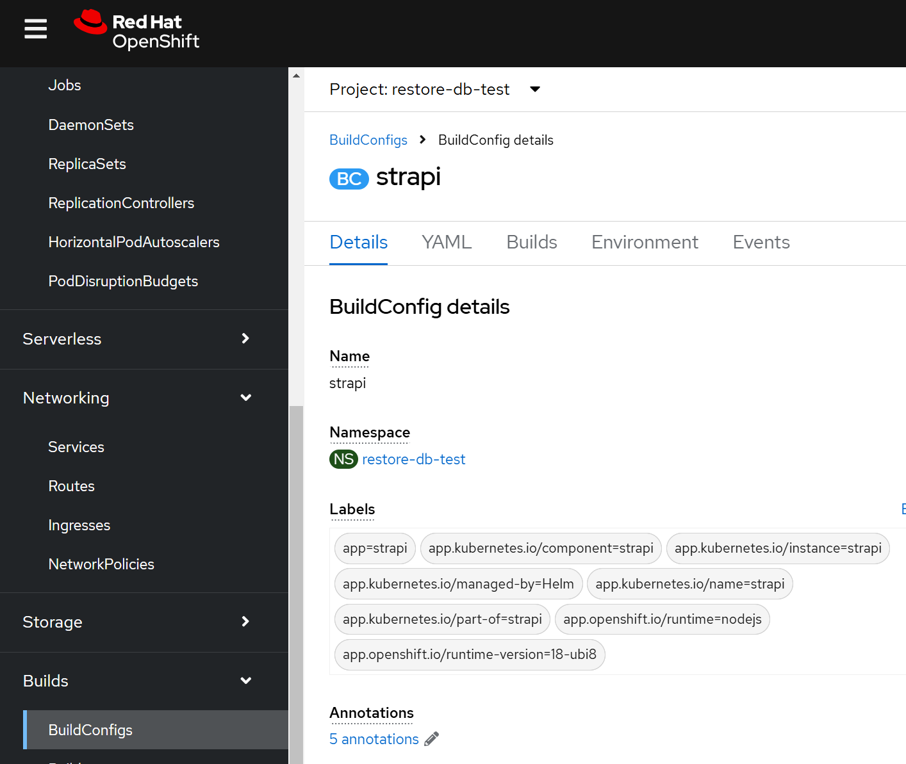
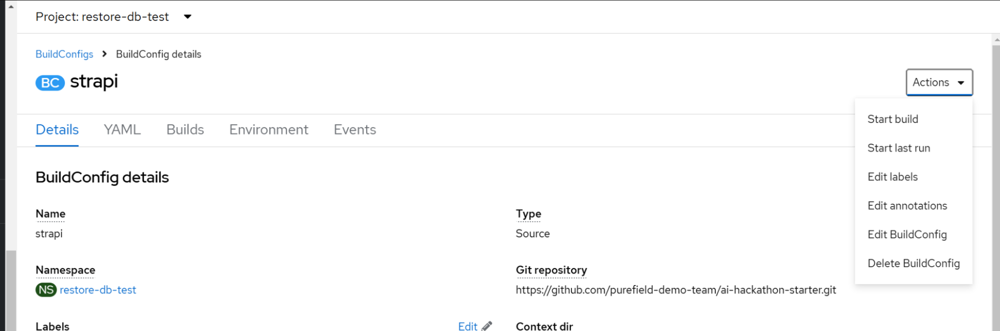
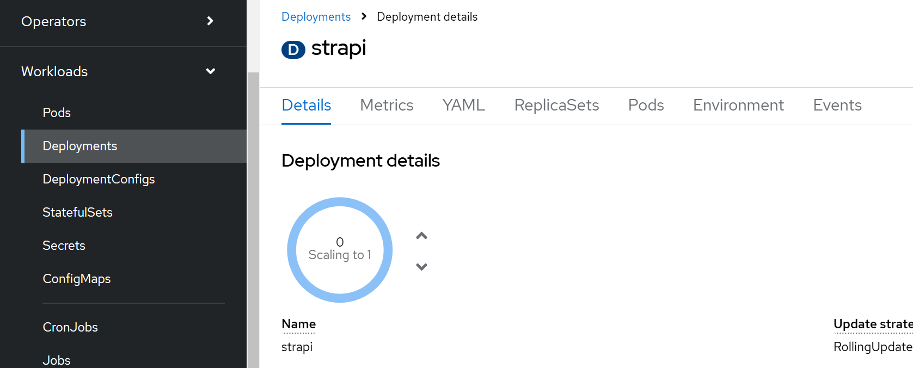
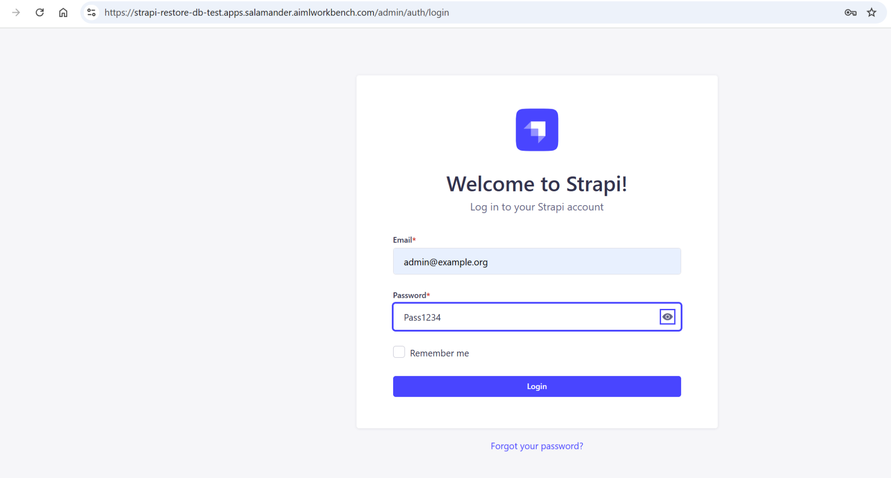
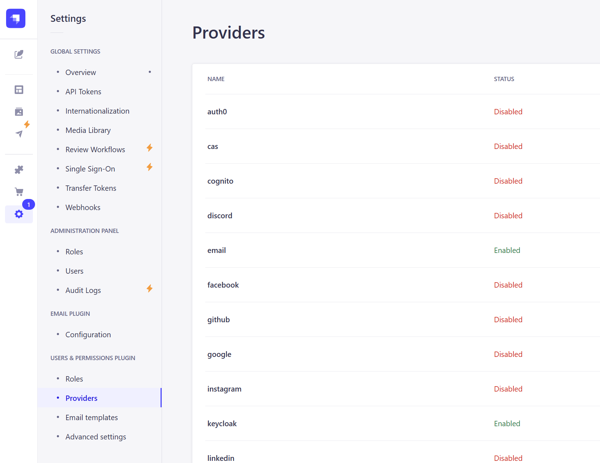

1. cd gitops/strapi
2. Just like with the keycloak values.yaml, you will need to modify the cluster name and domain to match your cluster’s values. Leave everything else as is
3. Run **helm install strapi .**
4. 
5. We will restore the strapi.backup file the same way we restored the keycloak.backup file now
6. **oc port-forward svc/strapi-postgresql 5432**
7. 
8. Register the server with the username: userVTA and password:Ng1TjS46XVOAVpb4
9. 
10. Restore the strapi database from the strapi.backup file
11. 
12. 
13. Now find the strapi BuildConfig inside the OpenShift console
14. 
15. Run a build from the upper right Actions dropdown
16. 
17. Actions → Start build
18. Once the build finishes, the deployment of strapi should complete successfully. Wait for the strapi Deployment to indicate it has scaled from 0 to 1
19. 
20. 
21. You may need to delete the existing Pod created before the image was built to force the image pull and successful deployment
22. Click on the strapi route under Networking → Routes
23. Add /admin to the url to reach the admin login
24. 
25. Login with Email: [admin@example.org](mailto:admin@example.org) Password: Pass1234 (you can change this upon login)
26. Once logged into strapi, find the keycloak provider under the settings
27. 
28. Click the edit icon next to the keycloak provider
29. In the “Host URI (Subdomain) field, replace the “keycloak-raft-infra.apps.salamander.aimlworkbench.com” part before “/realms/fihr-rag-llm” with the route of your keycloak instance. KEEP THE /realms/fihr-rag-llm part
30. Later, when we have the react-front end running, we will need to modify the “Redirect-URL to your front end app” field. But we will leave that to a later step for now