Try out the system. It can do both **Natural Language to SQL** and **general RAG** for accomplishing Goals and Tasks
## 1 General RAG Use Case
1. Log into the react-frontend application
2. In the upper right click on “Tasks”
3. 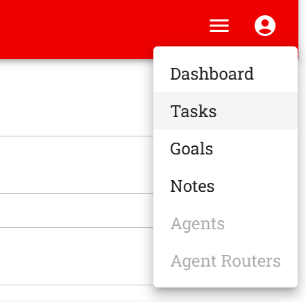
4. 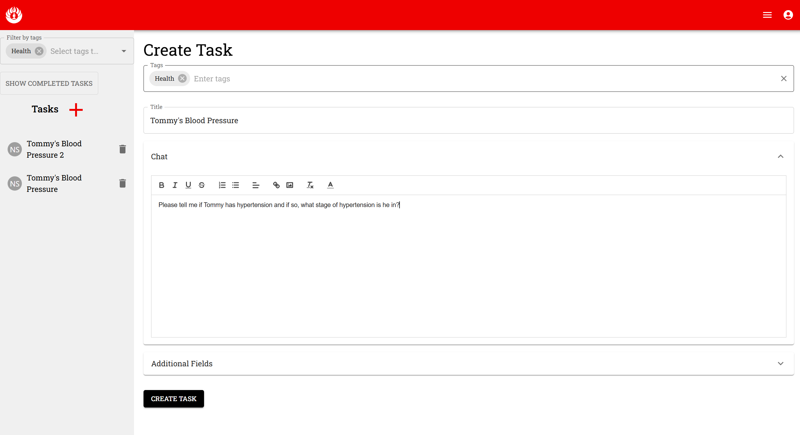
5. Click Create Task button
6. On the Update page click Submit
7. You will get a response that says it is unable to find the answer
8. 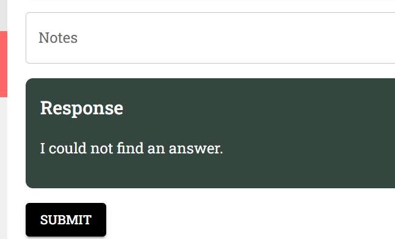
9. Now add some notes. Click the Add Note button
10. 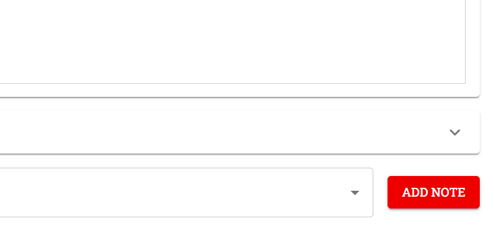
11. Add the title: "Blood Pressure Categories for Adolescents and Adults"
12. And the following note content:
```

1. **Normal Blood Pressure**:
   - Systolic <120 mmHg and Diastolic <80 mmHg
2. **Elevated Blood Pressure (Prehypertension in older guidelines)**:
   - Systolic 120-129 mmHg and Diastolic <80 mmHg
3. **Hypertension Stage 1**:
   - Systolic 130-139 mmHg or Diastolic 80-89 mmHg
4. **Hypertension Stage 2**:
   - Systolic ≥140 mmHg or Diastolic ≥90 mmHg
5. **Hypertensive Crisis** (Requires immediate medical attention):
   - Systolic >180 mmHg and/or Diastolic >120 mmHg
### Pediatric Hypertension (specific to age, sex, and height percentiles)
For children and adolescents (1-13 years), the classifications differ:
- **Normal**: <90th percentile
- **Elevated Blood Pressure**: ≥90th percentile to <95th percentile or 120/80 mmHg to <95th percentile (whichever is lower)
- **Hypertension Stage 1**: ≥95th percentile to <95th percentile + 12 mmHg, or 130/80 to 139/89 mmHg (whichever is lower)
- **Hypertension Stage 2**: ≥95th percentile + 12 mmHg, or ≥140/90 mmHg (whichever is lower)
### Considerations for Adolescents
- Adolescents aged 13 and older can use the adult classifications for hypertension stages.
- A diagnosis requires elevated readings on three separate occasions.
- Always ensure proper measurement techniques and conditions to minimize errors.
It is important to recognize that hypertension definitions can evolve, and updated guidelines may refine these categories. Always consult the latest standards from authoritative bodies such as the American Academy of Pediatrics or the American Heart Association.


```
13. 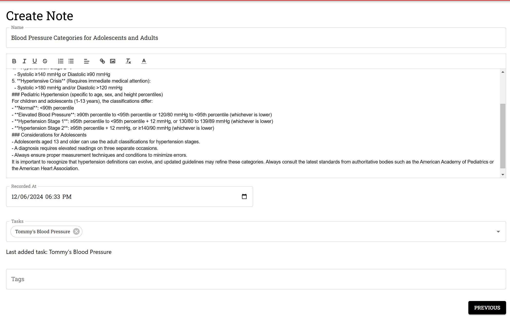
14. The note will auto save so there is no need to press a button
15. Click the Previous button to return to the Update Task page
16. Add another note that contains Tommy's patient history:
17. 
```

Age 14 yrs
Weight 68 Kg
Height 168 cm
98.1 F

Last 4 Patient visit readings for Blood Pressure
Blood Pressure 133/86 mm Hg
Blood Pressure 133/86 mm Hg
Blood Pressure 133/86 mm Hg
Blood Pressure 133/86 mm Hg


```
18. Click the Previous button again to return to the Update Task page
19. Click the Submit button
20. Now you should get a much better response. The response may not be ideal because we are using a llama 3 model that was fine tuned for sql generation. For better results a different model can be easily swapped in
21. 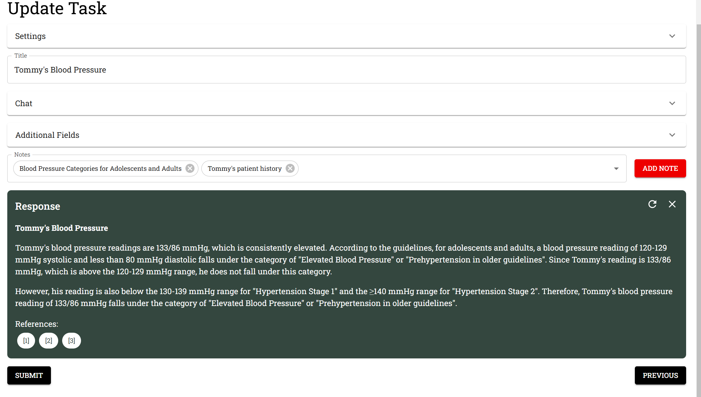

## 2 NL2SQL Use Case
1. Add a new Task
2. 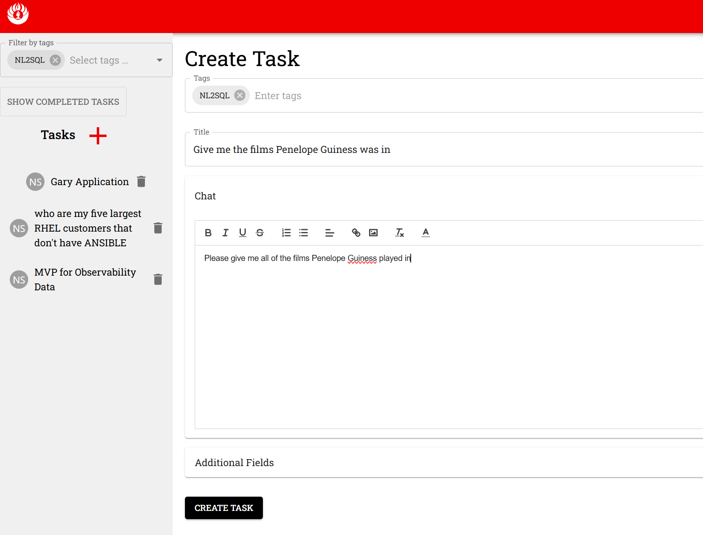
3. Add some notes about the n2sql sample database tables. This will generate embeddings, store them in redis search and be used to help generate sql with the local model
4. Right click on each of the tables and get their “create script” text
5. 
6. 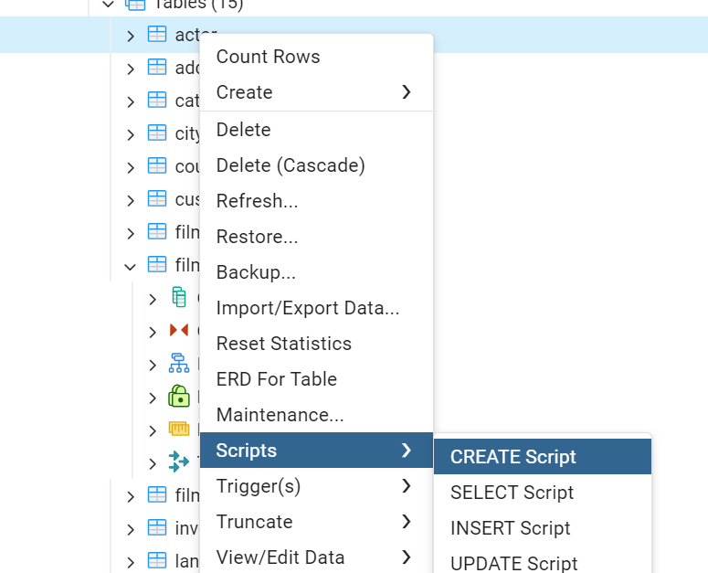
7. Back in the react-frontend on the Update Task page of the Task you just created, click on “Add Note”
8. 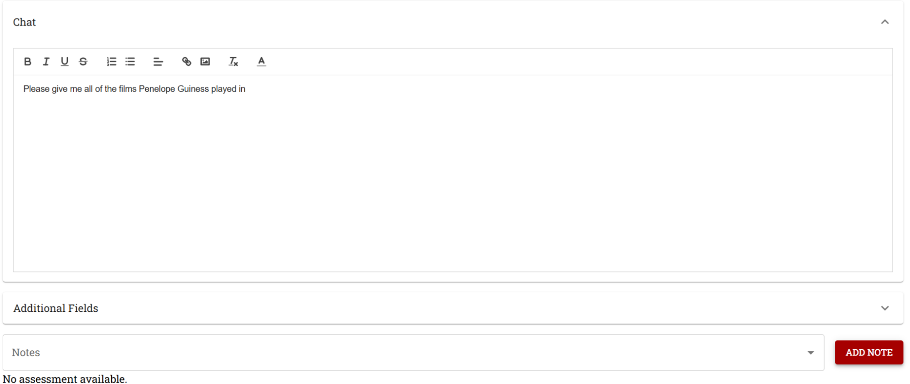
9. 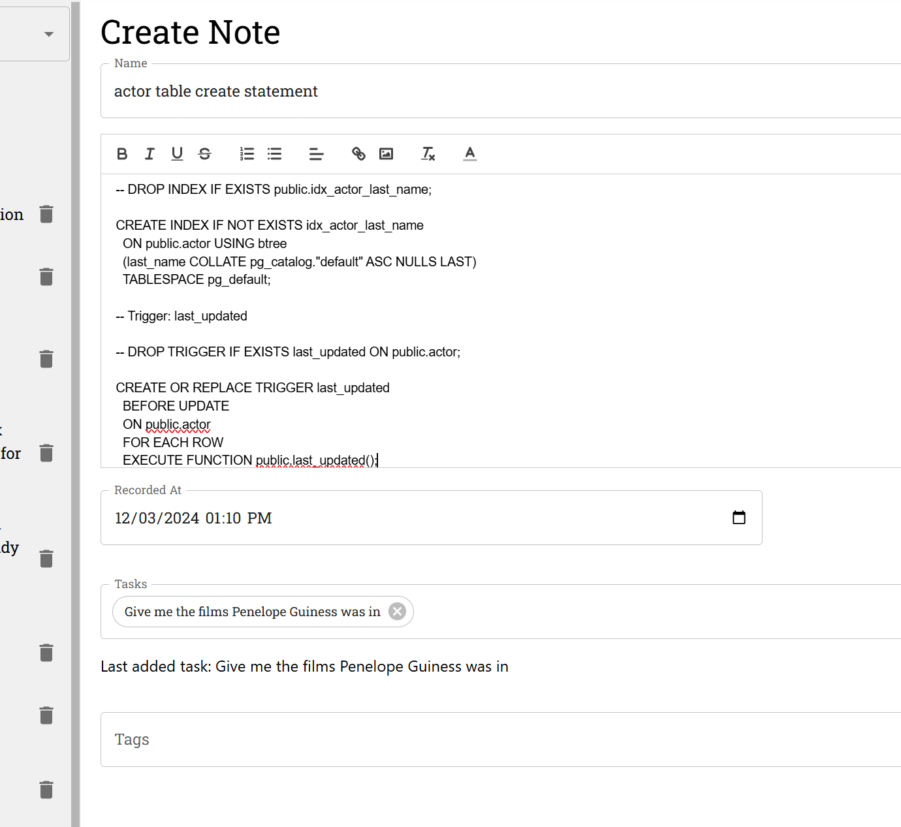
10. The note will automatically save and be associated with the Task you created
11. Hit the previous button
12. Repeat the Add Note process for each of the tables in the nl2sql sample database
13. On the update Task page, expand “Settings” accordion and select the NL2SQL Data source
14. 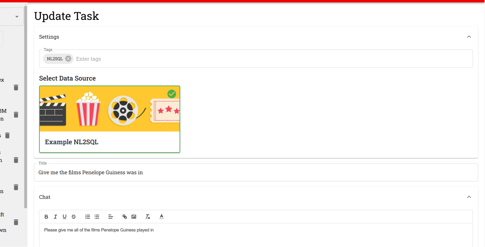
15. Click Submit
16. You should see a response like this in the green section
17. 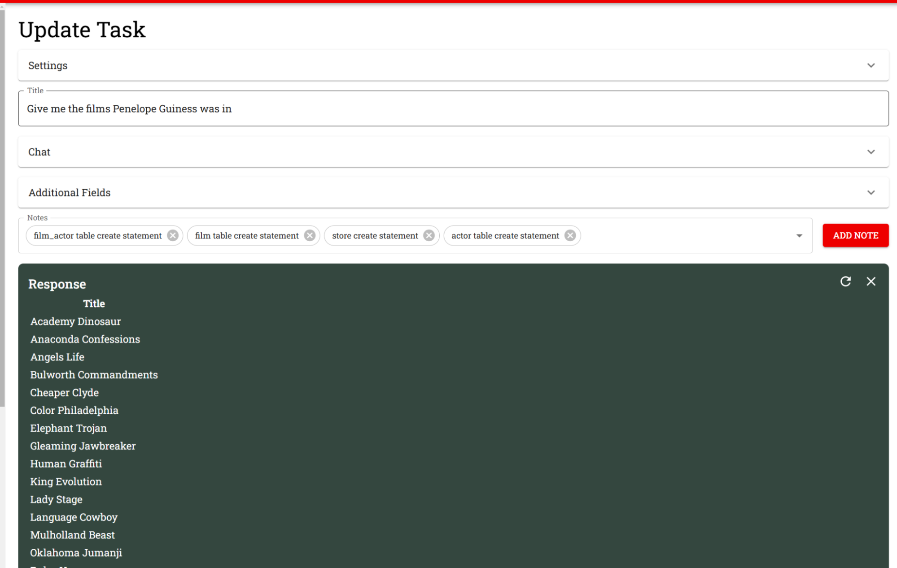
18. 