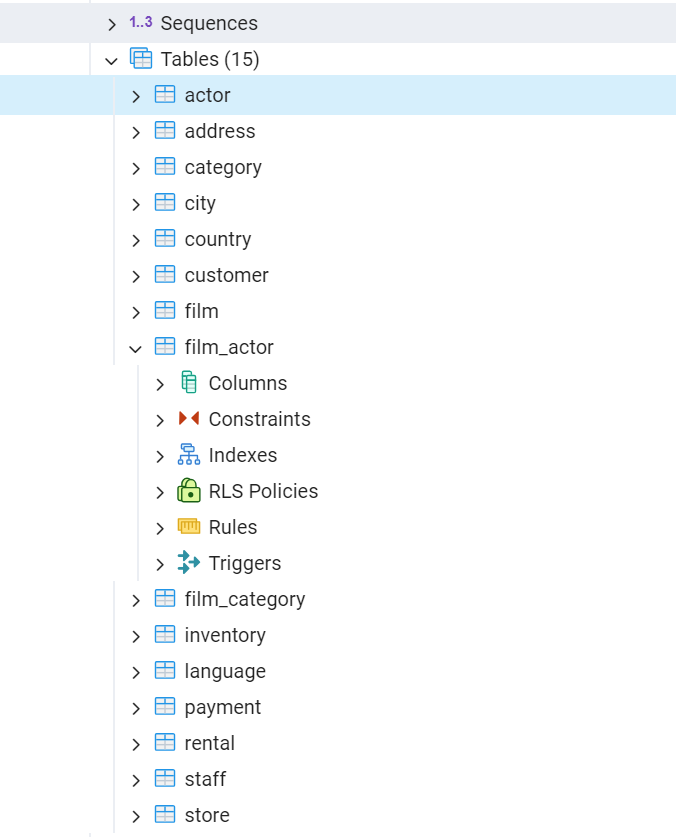

Try out the system. It can do both Natural Language to SQL and general RAG for accomplishing Goals and Tasks
1. Log into the react-frontend application
2. In the upper right click on “Tasks”
3. 
4. 
5. Add some notes about the n2sql sample database tables. This will generate embeddings, store them in redis search and be used to help generate sql with the local model
6. Right click on each of the tables and get their “create script” text
7. 
8. 
9. Back in the react-frontend on the Update Task page of the Task you just created, click on “Add Note”
10. 
11. 
12. The note will automatically save and be associated with the Task you created
13. Hit the previous button
14. Repeat the Add Note process for each of the tables in the nl2sql sample database
15. On the update Task page, expand “Settings” accordion and select the NL2SQL Data source
16. 
17. Click Submit
18. You should see a response like this in the green section
19. 
20. 